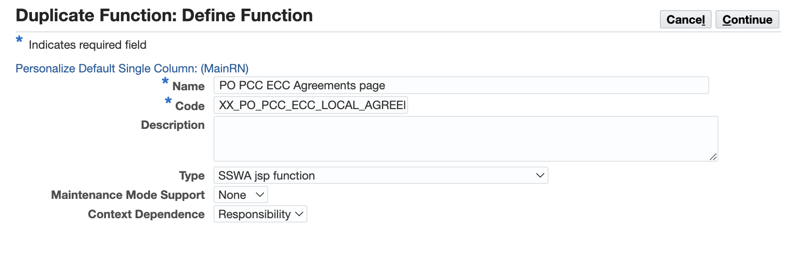
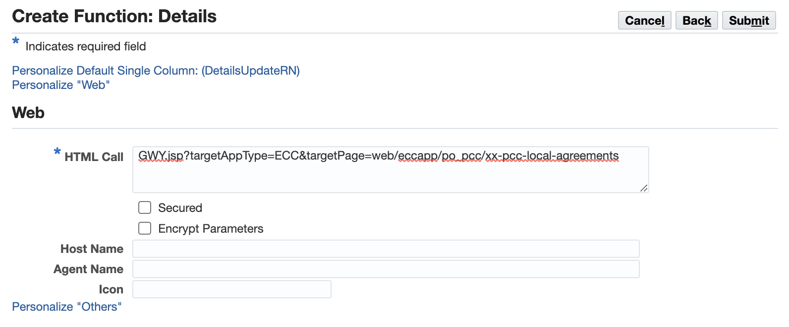
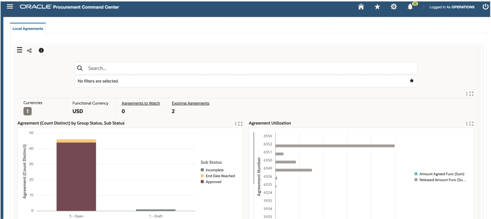
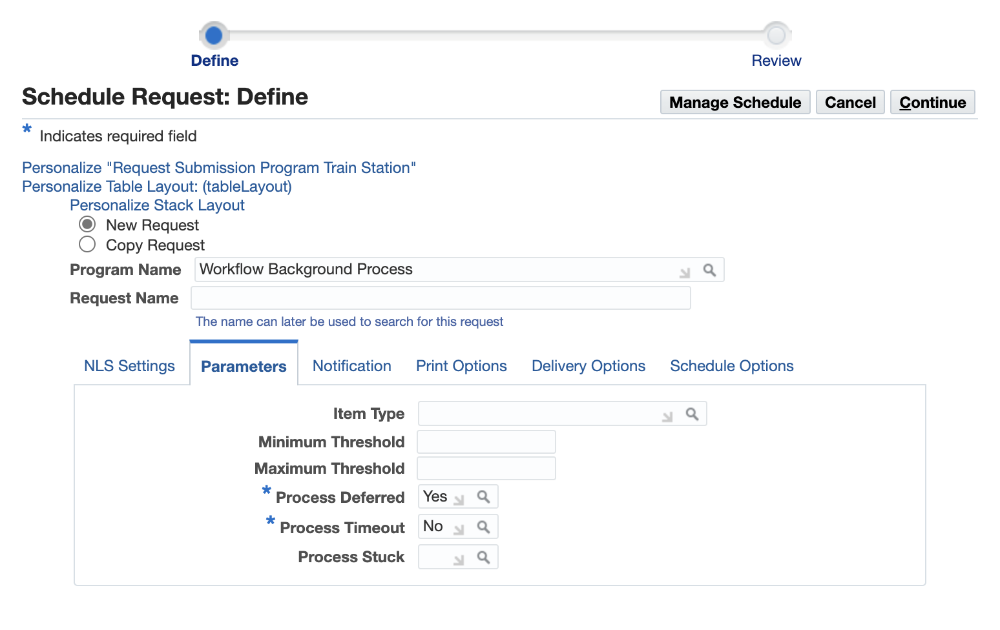
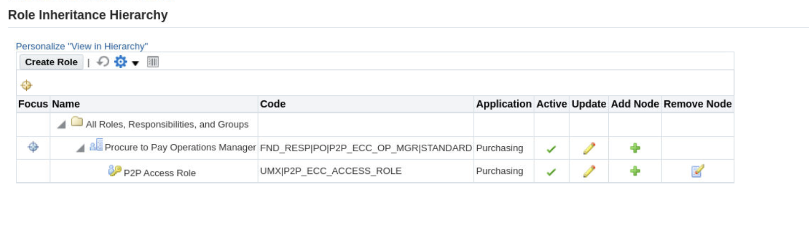
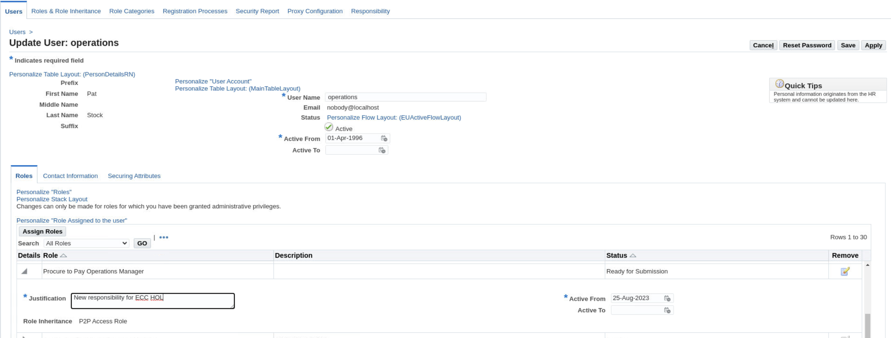

# ECC Personalization Template


### Introduction

This lab walks you through ECC Personalization features.

Estimated Time: 30 minutes


### Objectives

In this lab, you will:
* Personalize ECC Procurement
* ECC Personalization for Cross-departmental access


### Prerequisites

This lab assumes you have:
* Completed all previous labs successfully 


##  

## Task 1: ECC Personalization for ECC Procurement


**Goal:** In this task our goal is to provide Local Agreements dashboard access to the users who have access to Purchasing, Vision Operations responsibility
        
**Personalization Steps:**
        

1. Login to EBS apps (Navigate to http://apps.example.com:8000) with below credentials
    ```
  	 Username: sysadmin
Password: welcome1
    ```
2.	Create a new FND Function for Local Agreements Dashboard:
    * Navigate to Functional Administrator -> Core Services -> Functions
    * Search with Code as: 
                ```
  	    <copy>PO_PCC_ECC_AGREEMENTS</copy>
            ```
    * Click on the “Duplicate” icon displayed for PO\_PCC\_ECC\_AGREEMENTS
        

    * Change the details in the duplicate function page as mentioned below:
        * Name: 
                        ```
  	    <copy>PO PCC ECC Local Agreements Page</copy>
            ```
        * Code: 
                                ```
  	    <copy>XX_PO_PCC_ECC_LOCAL_AGREEMENTS</copy>
            ```
        

    * Click on the “Continue” button
    * Change the value for HTML Call to 
                                    ```
  	    <copy>GWY.jsp?targetAppType=ECC&targetPage=web/eccapp/po_pcc/xx-pcc-local-agreements</copy>
            ```
    * Click on the “Submit” button
         

3.	Add ECC Personalization Template to Procurement Command Center Menu:
    * Navigate to Functional Administrator Responsibility -> Core Services -> Menus
    * Search with code as 
                                        ```
  	    <copy>PO_PCC_MAIN</copy>
            ```
    * Click on “Update” button for “Procurement Command Center” menu
    * In the menu manager section, click on “+” icon to add below menu entry details
        * Prompt: 
                                                ```
  	    <copy>Local Agreements</copy>
            ```
        * Function: 
                                                        ```
  	    <copy>Fixed Assets Command Center Home</copy>
            ```
        * Click on “Apply” button to save the menu
        
3.	Create Permission Set for Local Agreements:
    * Navigate to Functional Administrator Responsibility -> Security -> Permission Sets
    * Click on the “Create Permission Set” button
    * Provide the below details in “Create Permission Set” page
        * Name: 
                                                                ```
  	    <copy>PO PCC Local Agreements Permission Set</copy>
            ```
        * Code: 
           ```
  	    <copy>PO_PCC_LOCAL_AGREEMENTS_PS</copy>
            ```
        * Under Permission Builder section, click on “+” icon to add the below permission:
            * Permission: 
                       ```
  	    <copy>PO PCC ECC Local Agreements page</copy>
            ```
    * Click on “Apply” button to create the permission set
        
4.	Create Grant for Local Agreements:
    * Navigate to Functional Administrator Responsibility -> Security -> Grants
    * Click on “Create Grant” button
    * Provide the below details:
        * Name: 
                               ```
  	    <copy>Procurement Local Agreements Grant</copy>
            ```
        * Grantee Type: Group of Users

        * Grantee: 
                                               ```
  	    <copy>PO PCC ECC Role</copy>
            ```
        * Responsibility: 
                                        ```
  	    <copy>Purchasing, Vision Operations (USA)</copy>
            ```
    * Click on the “Next” button
    * Provide the “Set”:
                                                   ```
  	    <copy>PO PCC Local Agreements Permission Set</copy>
            ```
    * Click on the “Next” button and then “Finish” button
        

    * Clear Application Cache:
        * Navigate to Functional Administrator -> Core Services -> Caching Framework -> Global Configuration
        * Click on “Clear All Cache” button and Click on "Yes"
        

**Personalize ECC Personalization Template to add Local Agreements dashboard**

1. Login to EBS apps (Navigate to http://apps.example.com:8000) with below credentials
    ```
  	 Username: operations
Password: welcome1
    ```
2.	Navigate to Purchasing, Vision Operations (USA) -> Procurement Command Center -> Local Agreements
        
3. Click on EBS Settings icon
4. Click on “Personalize Page” option
        

4.	In the Personalization structure table, click on “Personalize” icon for Page Layout section to update the window title
        

5.	Set the window title to “Local Agreements” and click on “Apply” button
        

6.	Personalize the Rich Container (dashboardRN1)
        

7. Update the below details and click on the “Apply” button
    * Title: 
                                                   ```
  	    <copy>Local Agreements</copy>
            ```
    * Rendered: TRUE
                                                       ```
  	    <copy>TRUE</copy>
            ```
    * Destination Function: 
                                                           ```
  	    <copy>XX_PO_PCC_ECC_LOCAL_AGREEMENTS</copy>
            ```
        

8. Set the subtab title by clicking on Personalize icon for first “Sub tab link”
        

9. Update the “Text” property to “Local Agreements” and click on "Apply"
        

10. Click on “Return to Application” to access the dashboard
        

11. To remove the other tabs, you should go back to the personalize "Header" step and change "Rendered" value to false for the other dashboards.
        
        


## Task 2: ECC Personalization for Cross-departmental access

**Goal:** As an Operations Manager, I want to monitor and measure the performance and efficiency of the entire procure-to-pay process so that I can identify opportunities for improvement, cost savings, compliance, and risk mitigation.
    

The ECC Personalization Template set up consists of two major steps: 

1. RBAC Set up
2. OA Personalization
    


**Pre-requisites:**

1.	EBS Form functions for the required ECC Dashboards which are to be displayed in the ECC Personalization Template

**Dashboard FND Functions:**


<!DOCTYPE html>
<html>
<head>
<style>
table {
  font-family: arial, sans-serif;
  border-collapse: collapse;
  width: 100%;
}

td, th {
  border: 1px solid #dddddd;
  text-align: left;
  padding: 8px;
}

tr:nth-child(even) {
  background-color: #dddddd;
}
style="white-space:pre-wrap; word-wrap:break-word"
</style>
</head>
<body>


<table>
  <tr>
    <th></th>
    <th>FND Function</th>
    <th>Permission Set</th>
    
  </tr>

  <tr>
    <td>Requisitions dashboard</td>
    <td>PO_PCC_ECC_REQUISITIONS</td>
    <td>PO_PCC_ECC_PS</td>
  </tr>
  <tr>
    <td>Orders dashboard</td>
    <td>PO_PCC_ECC_ORDERS</td>
    <td>PO_PCC_ECC_PS</td> 
  </tr>
  <tr>
    <td>Receiving dashboard</td>
    <td>INV_ECC_RCV</td>
    <td>INV_ECC_RCV_ACCESS_PS</td>
  </tr>
    <tr>
    <td>Supplier Balance dashboard</td>
    <td>AP_ECC_SUPP_BALANCE</td>
    <td>AP_ECC_ACCESS_PS</td>
</table>
</body>
</html>


1. Login to EBS apps (From the browser URL navigate to http://apps.example.com:8000) with below credentials

    ```
  	 Username: sysadmin
Password: welcome1
    ```

**Create a new Permission Set:**

1.	Navigate to Functional Administrator Responsibility -> Security -> Permission Sets
2.	Click on “Create Permission Set”
3.	Provide the below details in “Create Permission Set” page
    *	Name: 
                                                       ```
  	    <copy>P2P Permission Set</copy>
            ```
    *	Code: 
                                                           ```
  	    <copy>P2P_PS</copy>
            ```
    *	Under Permission Builder section, click on “+” icon to add the below permission sets:	
                                                                   ```
  	    <copy>PO PCC Permission Set</copy>
            ```
                                                                   ```
  	    <copy>Receiving ECC Dashboard Access Permission Set</copy>
            ```
                                                                   ```
  	    <copy>Payables Command Center Access Permission Set</copy>
            ```
4.	Click on “Apply” button to create the permission set

    

**Create a new Menu:**

1.	Navigate to Functional Administrator Responsibility -> Core Services -> Menus
2.	Click on “Create Navigation Menu”
3.	Provide the below details in “Create Navigation Menu” page
    *	Name: 
                                                       ```
  	    <copy>P2P Menu</copy>
            ```
    *	Code: 
                                                           ```
  	    <copy>P2P_MENU</copy>
            ```
    *	Under Menu Builder section, click on “+” icon to add below menu entry details:
        *	Prompt: 
                                                                   ```
  	    <copy>P2P Operations</copy>
            ```
        *	Function: 
                                                                   ```
  	    <copy>Fixed Assets Command Center Home</copy>
            ```
4.	Click on “Apply” button to create the menu

    


**Create a new Responsibility:**

1.	Navigate to User Management -> Responsibility
    
2.	Click on “Create Responsibility”
3.	Provide the below details in “Create Responsibility” page
    *	Responsibility Name: 
                                                               ```
  	    <copy>Procure to Pay Operations Manager</copy>
            ```
    *	Menu: 
                                                               ```
  	    <copy>P2P Menu</copy>
            ```
    *	Responsibility Key: 
                                                               ```
  	    <copy>P2P_ECC_OP_MGR</copy>
            ```
    *	Application: 
                                                                   ```
  	    <copy>Purchasing</copy>
            ```
    *	Under Groups section, provide below details:
        *	Data Group Name: 
                                                                   ```
  	    <copy>Standard</copy>
            ```
        *	Application: 
                                                                   ```
  	    <copy>Purchasing</copy>
            ```
4.	Click on “Create” button to create the responsibility

    


**Create a new Access role and Grant:**

1.	Navigate to User Management -> Roles & Role Inheritance
2.	Click on “Create Role”
3.	Provide the below details in “Create Role” page
    *	Application: 
                                                               ```
  	    <copy>Purchasing</copy>
            ```
    *	Role Code: 
                                                               ```
  	    <copy>UMX|P2P_ECC_ACCESS_ROLE</copy>
            ```
    *	Display Name: 
                                                               ```
  	    <copy>P2P Access Role</copy>
            ```
    *	Description: 
                                                               ```
  	    <copy>P2P Access Role</copy>
            ```
4.	Click on “Create Grant” button
5.	Click on “Save and Proceed” button in the confirmation dialog to create the grant
6.	Now, the user is navigated to “Create Grant” page
7.	Provide the below details:
    *	Name: 
                                                               ```
  	    <copy>P2P Grant</copy>
            ```
    *	Under security context section, Responsibility: Procure to Pay Operations Manager
    *	Click on “Next” button
    *	Provide the permission set as “P2P Permission Set”
    *	Click on the “Next” button and then the “Finish” button to create the grant
8.	Now, upon clicking “Ok” in the confirmation dialog, the user is navigated to the “Update Access Role” page
9.	Click on “Apply” button

    
    

**Run Workflow Background Process:**

1.	Navigate to System Administration -> Schedule Requests
2.	Provide the Program Name as “Workflow Background Process”
3.	Under Parameters section, provide the below details:
    *	Process Deferred: Yes
    *	Process Timeout: No
        

4.	Click on “Continue” button and then on “Submit” button
5.  Once the “Workflow Background Process” request is completed successfully, proceed to the next step to clear the application cache


**Clear Application Cache:**

1.	Navigate to Functional Administrator -> Core Services -> Caching Framework -> Global Configuration
2.	Click on “Clear All Cache” button and click on "Yes" in the pop up

    


**Assign Access Role to Responsibility:**

1.	Navigate to User Management -> Roles & Role Inheritance
2.	Search for “Procure to Pay Operations Manager” responsibility
3.	Select the icon under “View In Hierarchy”

    

4.  Click on + icon under “Add node”
    

5.  Then search for “P2P Access Role” and click on “Go” button
    


7. Add the access role to the responsibility by clicking on the icon under quick select column
    
8. We have successfully assigned the access role to the responsibility
    


**Assign the Responsibility to User:**

1.	Navigate to User Management -> Users
2.	Provide the User Name as “OPERATIONS” and click on “Go” button
3.	Click on update icon in the results for OPERATIONS user
4.	Click on “Assign Roles” button and add “Procure to Pay Operations Manager”
5.	Provide the Justification like “New Responsibility for ECC HOL”
6.  Click on “Apply” button

    

7.  Run the “Workflow Background Process” request and “Clear the application cache” as done earlier

**Run Workflow Background Process:**

1.	Navigate to System Administration -> Schedule Requests
2.	Provide the Program Name as “Workflow Background Process”
3.	Under Parameters section, provide the below details:
    * Process Deferred: Yes
    * Process Timeout: No
4.	Click on “Continue” button and then on “Submit” button
5.	Once the “Workflow Background Process” request is completed successfully, proceed to the next step to clear the application cache

    

**Clear Application Cache:**

1.	Navigate to Functional Administrator -> Core Services -> Caching Framework -> Global Configuration
2.	Click on “Clear All Cache” button and then click on "Yes"

    


**Personalize ECC Personalization Template to add ECC Procure to Pay dashboards**


**Tasks:**

1. Login to EBS apps (From the browser URL navigate to http://apps.example.com:8000) to access ECC Personalization Template under “Procure to Pay Operations Manager” responsibility

    ```
  	 Username: operations
Password: welcome1
    ```
    

1.	Navigate to Procure to Pay Operations Manager -> P2P Operations
    

2.	Click on the EBS Settings icon
    

3.	Click on the “Personalize Page” option displayed in the popup
    


5.	In the Personalization structure table, click on “Personalize” icon for Page Layout section to update the window title
    

6.	Set the window title to “P2P Operations” and click on “Apply” button
    

7.	Set the “rendered” property to true in respective Tab Header sections
    
    

8.	Add the ECC Page FND function to respective Rich Container sections
    *	Destination Function: 
                                                               ```
  	    <copy>PO_PCC_ECC_REQUISITIONS</copy>
            ```
    *	Title: 
                                                               ```
  	    <copy>Requisitions</copy>
            ```
    *   Rendered: true


    
    

9.	Set the subtab title by clicking on Personalize icon for respective “Sub tab link”
    * Text: 
                                                               ```
  	    <copy>Requisitions</copy>
            ```
    * Rendered: TRUE


    
    
10.	Click on “Return to Application” to access the dashboard
11.	Now, you can view the Requisitions dashboard
12.	Similarly, you can add the other remaining dashboards by using the below FND functions 

<!DOCTYPE html>
<html>
<head>
<style>
table {
  font-family: arial, sans-serif;
  border-collapse: collapse;
  width: 100%;
}

td, th {
  border: 1px solid #dddddd;
  text-align: left;
  padding: 8px;
}

tr:nth-child(even) {
  background-color: #dddddd;
}
style="white-space:pre-wrap; word-wrap:break-word"
</style>
</head>
<body>


<table>
  <tr>
    <th>Title</th>
    <th>FND Function</th>
    
  </tr>

  <tr>
    <td>Requisitions</td>
    <td>PO_PCC_ECC_REQUISITIONS</td>
  </tr>
  <tr>
    <td>Orders</td>
    <td>PO_PCC_ECC_ORDERS</td>
  </tr>
  <tr>
    <td>Receiving</td>
    <td>INV_ECC_RCV</td>
  </tr>
    <tr>
    <td>Supplier Balance</td>
    <td>AP_ECC_SUPP_BALANCE</td>
</table>
</body>
</html>


## Learn More
* [Enterprise Command Center- User Guide](https://docs.oracle.com/cd/E26401_01/doc.122/e22956/T27641T671922.htm)
* [Enterprise Command Center- Administration Guide](https://docs.oracle.com/cd/E26401_01/doc.122/f34732/toc.htm)
* [Enterprise Command Center- Extending Guide](https://docs.oracle.com/cd/E26401_01/doc.122/f21671/T673609T673618.htm)
* [Enterprise Command Center- Installation Guide](https://support.oracle.com/epmos/faces/DocumentDisplay?_afrLoop=264801675930013&id=2495053.1&_afrWindowMode=0&_adf.ctrl-state=1c6rxqpyoj_102)
* [Enterprise Command Center- Direct from Development videos](https://learn.oracle.com/ols/course/ebs-enterprise-command-centers-direct-from-development/50662/60350)
* [Enterprise Command Center for E-Business Suite- Technical details and Implementation](https://mylearn.oracle.com/ou/component/-/117416)

## Acknowledgements

* **Author**- Muhannad Obeidat, VP

* **Contributors**-  Muhannad Obeidat, Nashwa Ghazaly, Mikhail Ibraheem, Rahul Burnwal, Manikanta Kumar and Mohammed Khan

* **Last Updated By/Date**- Mohammed Khan, August 2023

