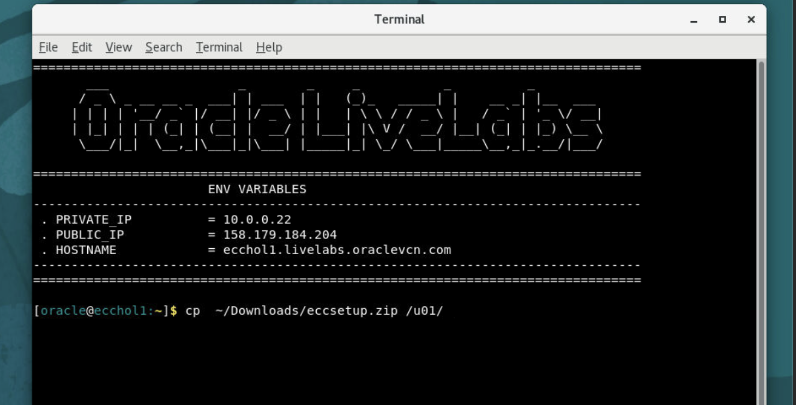

# Prerequisites


## Introduction

This lab is with regards to ECC Installation and is a prerequisite to the rest of the labs. 

*Estimated Lab Time:* 20 minutes

### Objectives
-   Install ECC


## Task 1: Install ECC

1. Open the no-vnc url , open chrome broswer and paste the following URL
                                                      ```
  <copy>https://media.githubusercontent.com/media/ecchol/Oracle/my-new-branch/eccsetup.zip?download=true</copy>
            ```

2. Open Terminal and enter the following command
                                                      ```
  <copy>cp  ~/Downloads/eccsetup.zip /u01/</copy>
            ```


3. From the teminal navigate to the below location:
                                                      ```
<copy>cd  /u01/</copy>
            ```

4. Unzip and execute the setup file to install ECC
                                                      ```
  <copy>unzip eccsetup.zip</copy>
            ```

                                                      ```
<copy>sh ecc_install.sh</copy>
            ```
 
  


You may now **proceed to the next lab**.

## Acknowledgements
* **Author**- Muhannad Obeidat, VP

* **Contributors**-  Muhannad Obeidat, Nashwa Ghazaly, Mikhail Ibraheem, Rahul Burnwal, Manikanta Kumar and Mohammed Khan

* **Last Updated By/Date**- Mohammed Khan, August 2023


